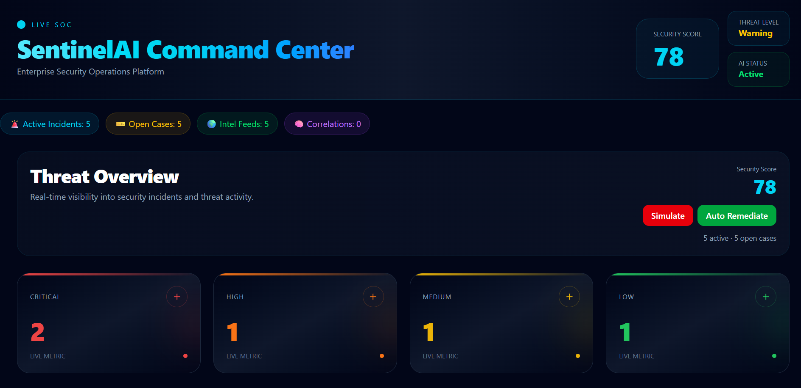
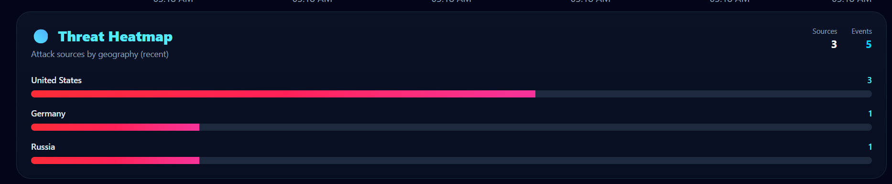

# SentinelAI-SOC

Enterprise-grade Security Operations Center (SOC) platform built with React and FastAPI.

SentinelAI-SOC provides real-time threat monitoring, incident investigation workflows, AI-assisted threat analysis, MITRE ATT&CK mapping, SOAR automation, and analyst-focused security operations dashboards.

---

## Features

### Security Monitoring

* Real-time incident tracking
* Security score monitoring
* Threat severity classification
* Active incident management

### Threat Intelligence

* Threat intelligence feeds
* IOC visibility
* Threat heatmap visualization
* Global attack source tracking

### Analyst Operations

* Analyst Workbench
* Investigation notes
* Evidence collection tracking
* Case management workflow

### AI-Assisted Security

* AI Threat Analyst
* Threat confidence scoring
* Automated recommendations
* AI Action Log

### Security Automation

* SOAR Playbook Engine
* Auto-remediation workflows
* Incident response recommendations

### Threat Mapping

* MITRE ATT&CK Mapping
* Attack timeline visualization
* SIEM correlation engine

---

## Architecture

Frontend:

* React
* Vite
* Recharts

Backend:

* FastAPI
* Python

---

## Project Screenshots

### Command Center


### Threat Trend


### Threat Heatmap


### Threat Intelligence Feed


### SOC Case Management


### SOAR Playbook Engine


### Analyst Workbench


### AI Threat Analyst


### AI Action Log


### MITRE ATT&CK Mapping


### SIEM Correlation Engine


### Live Attack Timeline


### Security Score History & Active Incidents


---

## Run Locally

Backend

```bash
cd backend
pip install fastapi uvicorn
uvicorn main:app --reload
```

Frontend

```bash
cd frontend
npm install
npm run dev
```

---

## Future Enhancements

* Live SIEM integration
* Splunk integration
* ELK Stack integration
* AI-powered anomaly detection
* Threat intelligence API integration
* SOC alert ingestion pipeline

---

## Author

Divyanshu Mishra
